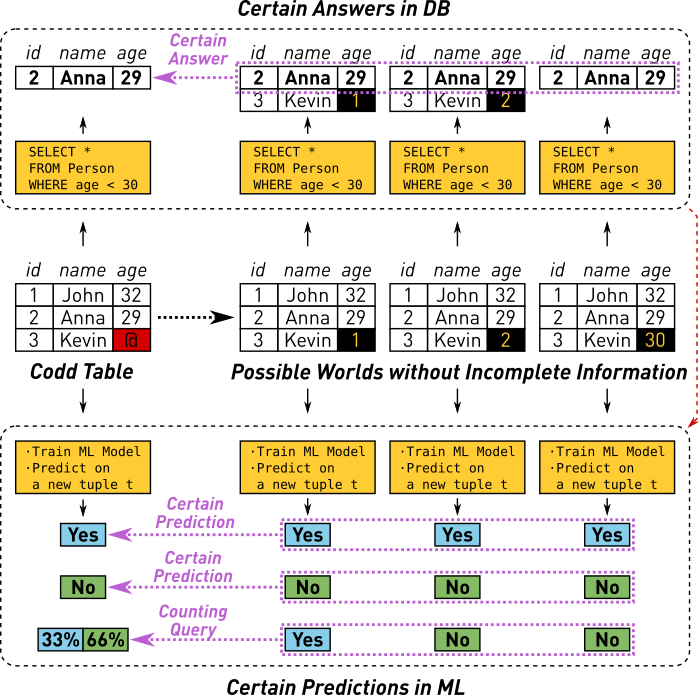

# Certain Prediction Framework (CPF)

This repository contains the implementation of the checking and counting queries that are defined under the *Certain Prediction* (CP) framework for K-Nearest Neighbor described in the paper:

**Nearest Neighbor Classifiers over Incomplete Information: From Certain Answers to Certain Predictions** [[arXiv]](https://arxiv.org/abs/2005.05117) <br/>
Bojan Karlaš, Peng Li, Renzhi Wu, Nezihe Merve Gürel, Xu Chu, Wentao Wu, Ce Zhang

The complete implementation can be found in the `cpf.py` file which has no dependencies other than the Python standard library. The simplest way to run it is with the following command:

```bash
./cpf.py [Q] [dataset] [example]
```

Here, `[Q]` should be replaced with either `q1` or `q2` for the checking and counting queries respectively, `[dataset]` is a CSV file containing the training dataset and `[example]` is the CSV file containing a test example for which we want to run the query. For example, the checking query (Q1) on a provided example dataset can be answered by using the following command:

```bash
./cpf.py q1 examples/test-dataset-1.csv examples/test-example-1.csv --k 3
```

We additionally specify `3` as the `k` parameter for the `k`-Nearest Neighbor algorithm (default is `1`). Running `./cpf.py -h` displays a listing of all command-line arguments.

## Method Summary



Certain Prediction is a notion that seeks to apply consistent query answering, a concept stemming from the database field, to the machine learning task of classification. Consistent query answering is concerned with answering some query `Q` over a dataset `D` that is *incomplete* (i.e. contains unknown values). Given an incomplete dataset, and knowing the domain of its values, we can induce a set of possible "repaired versions" of that dataset which are referred to as ***possible worlds***. In the above image, the dataset contains only one missing value (the age of Kevin). Given some assumption about the domain for that value (i.e. age of humans) we can expand that dataset into possible worlds, each one defined by a distinct valuation of missing values.

A query `Q` can thus be ***certainly answered*** if we can prove that the same answer will be returned for all possible worlds. In the example, for the query of persons with age below 30, we can only be certain that Anna will fall into this group.

In the context of *classification* for machine learning, we consider the scenario where our incomplete dataset `D` is used for training a classifier that is predicting the class label for some unseen data example. This "train + predict" pipeline corresponds to the query `Q` in this context and the predicted class label is the query answer. We may claim that a prediction is ***certain*** only if we can prove that the same class would get predicted for all possible worlds. In the above example, we can only be certain when predicting a label for a given test example if either all classifiers answer "Yes" or all answer "No". We refer to decision problem as the ***checking query (Q1)***.

 If there is disagreement between predictions among classifiers trained in different possible worlds, it often makes sense to compute the number of possible worlds that would result in a given predicted label. To answer this, we use the ***counting query (Q2)***.

 When there are multiple missing values, the space of possible worlds is constructed through a Cartesian product of domains of each missing value. This space grows exponentially with the number of missing values which makes it practically infeasible to answer these queries for a general ML classifier. In this framework, we provide efficient query implementations for the KNN classifier that make it possible to answer both of these queries in polynomial time.

## Dataset Format

In this framework, we assume tabular training datasets with numerical features. Domains for all missing values are explicitly defined. We rely on a slightly modified CSV format to represent such datasets. Here is an example:

```csv
a,b[1|2|3],c
0,,1
1,2,2
1,[2|3],3
0,2,4
0,,5
```

The first line contains comma-separated column definitions. By default the first column conains the labels, altough it is possible to change this with an argument. If a column contains missing values, the domain for those values can be defined by enclosing a list of values separated by the pipe character `|` in square brackets `[]` right after the column name.

All remaining lines contain reguler comma-separated numerical values, except that missing values are either specified by: (1) an explicit domain definition enclosed in square brackets; or (2) an empty string which means that they will inherit the domain of their column. In the latter case, if a column does not have a domain definition, an error will be thrown.

Test examples are given as a single-line CSV file (i.e. without a column header) and without any missing values. Here is an exampe:

```csv
2,1
```

It must have one column less than the training dataset which would correspond to the label column. The column order is assumed to be the same as the training dataset.
